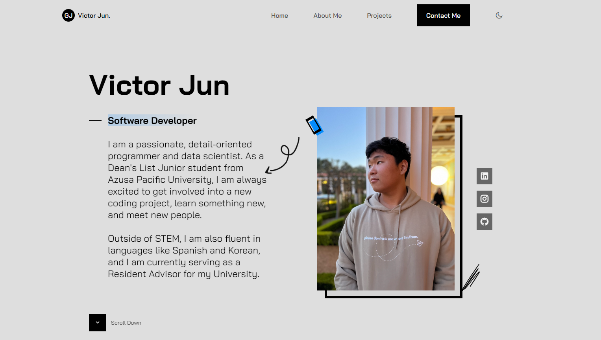

# 💻 Personal Portfolio Website

> A modern, responsive portfolio website showcasing my software engineering projects, skills, and professional experience with integrated contact functionality.

[](https://developer.mozilla.org/en-US/docs/Web/CSS)
[](https://developer.mozilla.org/en-US/docs/Web/HTML)
[](https://developer.mozilla.org/en-US/docs/Web/JavaScript)
[](https://www.emailjs.com/)

## 🔗 Live Demo

**[View Live Portfolio](https://gerojun.github.io/Personal-Portfolio-Website/)** — *Hosted on GitHub Pages*

## 🎯 Overview

This is my personal portfolio website designed to present my professional brand to recruiters and hiring managers. The site demonstrates my ability to create polished, user-friendly web experiences while showcasing:

- **Front-End Development Skills**: Clean, semantic HTML5, modern CSS3 styling, and vanilla JavaScript
- **Responsive Design**: Mobile-first approach ensuring optimal viewing on all devices
- **UI/UX Design**: Intuitive navigation and professional visual hierarchy
- **Third-Party Integration**: EmailJS for serverless contact form functionality
- **Project Management**: Organized project showcase with descriptions and technologies used

Built from scratch without frameworks to demonstrate fundamental web development competency.

## ✨ Features

### 📧 Contact Form Integration
- **Direct Email Communication** via EmailJS API
- **Form Validation** for required fields and email format
- **User Feedback** with success/error messages
- **No Backend Required** - serverless email delivery

### 📱 Responsive Design
- **Mobile-First Approach** for all screen sizes
- **Fluid Layouts** that adapt to viewport dimensions
- **Optimized Images** for fast loading times
- **Cross-Browser Compatible** (Chrome, Firefox, Safari, Edge)

### 🎨 Professional UI
- **Clean, Modern Aesthetic** aligned with industry standards
- **Smooth Scrolling** navigation between sections
- **Icon Integration** using Remixicon library
- **Semantic HTML** for accessibility and SEO

### 💼 Content Sections
- **Hero Section** - Introduction and call-to-action
- **About Me** - Background, education, and career goals
- **Projects** - Portfolio of completed work with descriptions
- **Skills** - Technical proficiencies and tools
- **Contact** - Functional contact form and social links

## 🛠️ Tech Stack

### Frontend
- **HTML5** - Semantic markup and structure
- **CSS3** - Custom styling with flexbox and grid layouts
- **JavaScript (ES6+)** - Interactive functionality and form handling

### Libraries & APIs
- **EmailJS** - Email service for contact form submissions
- **Remixicon** - Modern icon library for UI elements

### Deployment
- **GitHub Pages** - Free static site hosting
- **Git** - Version control and collaboration

## 📸 Preview

### Desktop View


*The portfolio features a clean, professional design optimized for showcasing projects to potential employers.*

## 🚀 Getting Started

### Prerequisites
- Web browser (Chrome, Firefox, Safari, or Edge)
- Text editor (VS Code, Sublime Text, etc.) for modifications
- Git for version control (optional)

### Installation & Setup

1. **Clone the repository**
```bash
git clone https://github.com/GeroJun/Personal-Portfolio-Website.git
cd Personal-Portfolio-Website
```

2. **Open in browser**
```bash
# Simply open index.html in your preferred browser
# Or use a local development server:
python -m http.server 8000  # Python
# or
npx serve  # Node.js
```

3. **Configure EmailJS (for contact form)**
```javascript
// In your JavaScript file, update with your EmailJS credentials:
emailjs.init("YOUR_PUBLIC_KEY");

emailjs.send(
    "YOUR_SERVICE_ID",
    "YOUR_TEMPLATE_ID",
    {
        name: name,
        email: email,
        message: message
    }
);
```

### Customization

**Update Personal Information:**
- Edit `index.html` to change text content, project descriptions, and links
- Replace profile images in the `assets/` folder
- Update social media links in the contact section

**Modify Styling:**
- Edit CSS variables in the root of your stylesheet for theme colors
- Adjust responsive breakpoints in media queries
- Customize fonts by changing the imported Google Fonts

## 📁 Project Structure

```
Personal-Portfolio-Website/
├── assets/
│   ├── images/              # Project screenshots and profile photos
│   ├── icons/               # UI icons and favicons
│   └── css/
│       └── styles.css       # Main stylesheet
├── js/
│   └── main.js              # JavaScript for interactivity
├── index.html               # Main HTML file
├── preview.png              # Portfolio preview image
└── README.md               # Documentation
```

## 💡 Key Technical Implementations

### 1. Responsive Navigation
```javascript
// Mobile menu toggle functionality
const navToggle = document.querySelector('.nav-toggle');
const navMenu = document.querySelector('.nav-menu');

navToggle.addEventListener('click', () => {
    navMenu.classList.toggle('active');
});
```

### 2. Smooth Scrolling
```javascript
// Smooth scroll to section on navigation click
document.querySelectorAll('a[href^="#"]').forEach(anchor => {
    anchor.addEventListener('click', function (e) {
        e.preventDefault();
        document.querySelector(this.getAttribute('href'))
            .scrollIntoView({ behavior: 'smooth' });
    });
});
```

### 3. Form Submission with EmailJS
```javascript
// Contact form integration
form.addEventListener('submit', (e) => {
    e.preventDefault();
    emailjs.sendForm('service_id', 'template_id', form)
        .then(() => {
            showSuccessMessage();
            form.reset();
        })
        .catch(error => {
            showErrorMessage(error);
        });
});
```

## 📚 What I Learned

### Technical Skills
- **Responsive Web Design**: Creating layouts that work seamlessly across devices using CSS Grid and Flexbox
- **Form Handling**: Implementing client-side validation and integrating third-party email services
- **DOM Manipulation**: Using vanilla JavaScript for interactive UI elements without frameworks
- **Web Performance**: Optimizing images and minimizing HTTP requests for faster load times

### Professional Skills
- **Personal Branding**: Effectively communicating my value proposition to potential employers
- **Content Strategy**: Organizing project information for maximum impact
- **User Experience**: Designing intuitive navigation and clear calls-to-action
- **Deployment**: Configuring GitHub Pages for production hosting

### Design Principles
- **Visual Hierarchy**: Guiding user attention through typography and spacing
- **Color Theory**: Creating a professional color palette that reflects my brand
- **Accessibility**: Using semantic HTML and ensuring keyboard navigation
- **Mobile-First**: Designing for smaller screens first, then scaling up

## 🚀 Future Enhancements

Planned improvements to expand functionality:

- [ ] **Dark/Light Mode Toggle** - Theme switcher for user preference
- [ ] **Blog Section** - Technical writing and project deep-dives
- [ ] **Project Filtering** - Sort projects by technology or category
- [ ] **Animation Library** - Subtle animations using Intersection Observer
- [ ] **Analytics Integration** - Track visitor behavior with Google Analytics
- [ ] **SEO Optimization** - Meta tags and Open Graph for social sharing
- [ ] **Performance Optimization** - Lazy loading images and code splitting
- [ ] **Accessibility Audit** - WCAG 2.1 compliance testing
- [ ] **Multi-language Support** - Internationalization for global audience
- [ ] **CMS Integration** - Headless CMS for easy content updates
- [ ] **Testimonials Section** - Display recommendations and feedback
- [ ] **Resume Download** - PDF download functionality

## 🔗 Connect With Me

- 🐱 **GitHub**: [@GeroJun](https://github.com/GeroJun)
- 🔗 **LinkedIn**: [Victor (Gero) Jun](https://www.linkedin.com/in/gerojun)
- 📧 **Email**: [Contact via website](https://gerojun.github.io/Personal-Portfolio-Website/#contact)

## 📝 License

This project is open source and available for personal and educational use.

---

## 👤 About the Developer

**Victor (Gero) Jun**
- 🎓 Senior CS Student @ Azusa Pacific University (Graduating May 2026)
- 💼 Software Engineer Intern
- 🎯 Seeking SWE roles with visa sponsorship
- ✨ Passionate about backend development, authentication systems, and full-stack applications

---

⭐ **If you like this portfolio, please consider giving it a star!**

*Designed and built by Victor Jun | © 2024*
